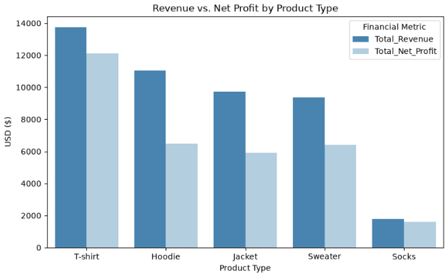
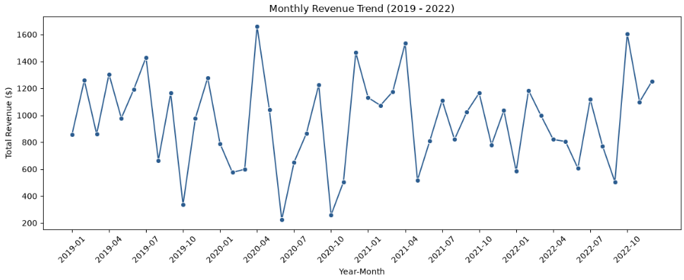
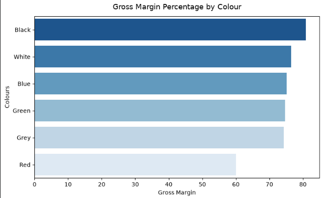
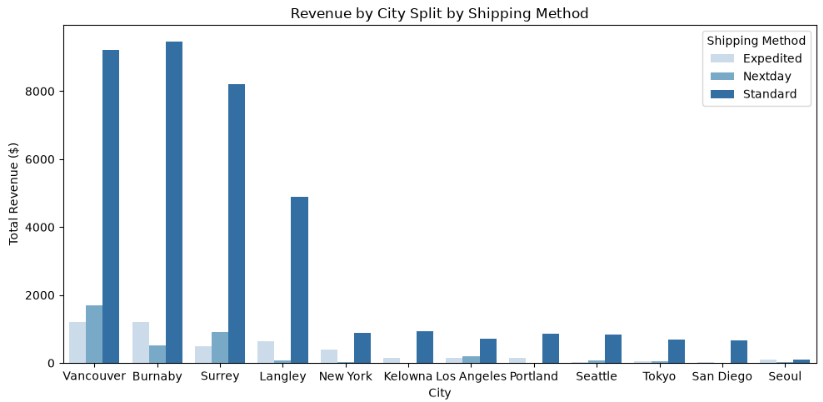
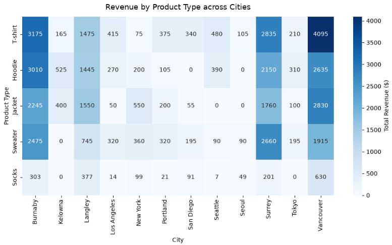

# 📊 365 Men's Clothing Store | Retail Sales & Financial Analytics

---

## 📌 Project Overview

This project presents an end-to-end **retail sales analytics case study** for **365 Men's Clothing Store**, analysing transaction performance across **2019–2022**.

The analysis combines transaction, product, store, and shipping data to evaluate **revenue, net profit, product mix, profitability, seasonality, geographic concentration, shipping behaviour, discounting, and data quality**.

The project is structured as a two-phase workflow: an initial Python data-preparation case study followed by an extended **Phase II analysis** focused on deeper business questions, data-quality reconciliation, feature engineering, visual analysis, and management recommendations.

---

# 🏆 Project Highlights

| Metric | Value |
|---|---:|
| 📅 Analysis Period | **2019–2022** |
| 🧾 Final Orders | **603** |
| 📦 Units Sold | **1,807** |
| 💰 Total Revenue | **$45,682** |
| 💵 Total Net Profit | **$32,509** |
| 📍 Top 3 City Revenue Share | **72.1%** |
| 📈 Peak Combined Month | **April — $5,319** |
| 📉 Lowest Combined Month | **June — $2,830** |

> **Margin note:** The notebook's `Gross Margin %` metric is calculated as `Net Profit / Revenue`. It is therefore presented here as a **net-profit-to-revenue margin** rather than a conventional accounting gross margin.

---

# 📷 Dashboard & Visualizations Preview

The project contains five core visuals required by the Phase II analysis, along with additional supporting charts.

---

## 1️⃣ Revenue & Net Profit by Product Type



This comparison shows the difference between **commercial scale and profit generation** across T-shirts, Hoodies, Sweaters, Jackets, and Socks.

**Key observation:** T-shirts generate the highest revenue and aggregate net profit, while Socks contribute the smallest revenue but have the highest product-type margin metric.

---

## 2️⃣ Continuous Monthly Revenue Trend — 2019–2022



The continuous time-series view shows how revenue moved month-by-month throughout the complete four-year period, making individual peaks and troughs visible rather than separating the analysis into four isolated yearly charts.

**Key observation:** The broader seasonal analysis identifies **April** as the strongest combined month and **June** as the weakest combined month across 2019–2022.

---

## 3️⃣ Profitability by Colour



The colour-level view highlights differences in the percentage of revenue retained as net profit across the range.

**Key observation:** **Black** has the strongest colour-level margin metric at **76.52%**, while **Red** is lowest at **60.00%**. Margin alone is not sufficient evidence to discontinue a colour; sales volume, assortment, and product-level performance also need to be considered.

---

## 4️⃣ Revenue by City & Shipping Method



This stacked chart combines **geography and fulfillment method**, showing where revenue is generated and how shipping services are distributed across cities.

**Key observation:** Standard shipping dominates the dataset with **494 orders** and **$37,474 revenue**, while Expedited and Nextday account for the remaining shipping activity.

---

## 5️⃣ Revenue Heatmap — Product Type × City



The heatmap connects **product assortment with geography**, making unusually weak or strong city/type combinations easier to identify.

**Key observation:** **Seattle × Socks** is the weakest non-zero city/type combination by within-city revenue share, with only **$7**, equal to about **0.72%** of Seattle revenue in the final analytical dataset.

---

# 🎯 Project Objectives

- Audit and clean the raw retail datasets before analysis.
- Reconcile records lost during joins instead of silently dropping them.
- Detect and remove exact duplicate transaction rows.
- Engineer reusable financial and time-based metrics.
- Evaluate product type and colour profitability.
- Analyse annual revenue and net profit performance.
- Identify monthly seasonality and weekday/weekend purchasing patterns.
- Measure revenue concentration across cities.
- Analyse shipping-method revenue, order volume, and AOV.
- Evaluate discount activity, particularly on Socks.
- Identify underperforming product-type/city combinations.
- Translate analytical findings into practical business recommendations.

---

# 📂 Dataset Description

The project uses four source extracts plus an integrated Excel dataset:

| File | Description |
|---|---|
| `Products.csv` | Product ID, product name, price, cost, type, and colour |
| `Shipping.csv` | Order ID, city, and shipping method |
| `Stores.csv` | Store ID to city mapping |
| `Transactions.csv` | Order ID, transaction line, product, date, quantity, revenue, and profit fields |
| `orders_data.xlsx` | Integrated dataset used for the extended Phase II analysis |

The final analytical dataset contains **603 orders**, **1,807 units sold**, and covers **January 2, 2019 through December 29, 2022**.

---

# 🔍 Data Quality Audit

A major focus of Phase II was validating whether the integrated dataset was complete and whether previous cleaning decisions were defensible.

### Join Reconciliation

- **51 shipping records** were lost during relational joins, approximately **7.8%** of the raw shipping file.
- **51 transaction lines** were also lost, approximately **7.72%** of the raw transaction file.
- The identified join losses were concentrated in **Coquitlam**, making the issue a city-specific data-coverage problem rather than a random loss.

### Duplicate Transactions

- **7 exact duplicate rows** were removed from the raw transaction data.
- This represented approximately **1.06%** of the original transaction rows.
- The duplicate treatment was based on exact-row duplication rather than assuming that repeated purchases were duplicates.

### Basket Integrity

The transaction file contains **603 unique OrderIDs**, and **0 orders contain more than one transaction line** in the analysed population.

This means each recorded order is effectively a **single-item basket** in this dataset. As a result, traditional basket-level cross-selling or market-basket analysis cannot meaningfully be derived from the current transaction structure.

---

# 📊 Key Business Analysis

## 💰 1. Financial Performance — 2019–2022

| Year | Revenue | Revenue YoY | Net Profit | Net Profit YoY |
|---|---:|---:|---:|---:|
| 2019 | $12,297 | — | $8,535 | — |
| 2020 | $9,856 | **-19.85%** | $7,088 | **-16.95%** |
| 2021 | $12,179 | **+23.57%** | $8,622 | **+21.64%** |
| 2022 | $11,350 | **-6.81%** | $8,264 | **-4.15%** |

The analysis shows a contraction in **2020**, followed by a strong recovery in **2021** and a moderate decline in **2022**. The highest annual revenue was recorded in **2019**, while the highest annual net profit was recorded in **2021**.


---

## 👕 2. Product Mix & Profitability

| Product Type | Revenue | Net Profit | Margin Metric | Units Sold |
|---|---:|---:|---:|---:|
| T-shirt | $13,745 | $12,103 | **88.05%** | 821 |
| Hoodie | $11,040 | $6,495 | **58.83%** | 303 |
| Jacket | $9,740 | $5,900 | **60.57%** | 192 |
| Sweater | $9,365 | $6,415 | **68.50%** | 295 |
| Socks | $1,792 | $1,596 | **89.06%** | 196 |

The results show why **revenue ranking and profitability ranking should not be treated as the same thing**.

T-shirts are the largest revenue contributor and the largest aggregate profit contributor. Hoodies rank highly on revenue but have a materially lower margin metric. Socks have the lowest revenue contribution but the strongest percentage margin metric.

---

## 🌍 3. Geographic Revenue Concentration

| City | Revenue | Orders |
|---|---:|---:|
| Vancouver | **$12,105** | 165 |
| Burnaby | **$11,208** | 139 |
| Surrey | **$9,606** | 130 |
| Langley | $5,592 | 73 |
| New York | $1,284 | 14 |
| Kelowna | $1,090 | 10 |
| Los Angeles | $1,069 | 16 |
| Portland | $1,021 | 15 |
| Seattle | $967 | 12 |
| Tokyo | $815 | 10 |
| San Diego | $681 | 13 |
| Seoul | $244 | 6 |

The top three cities — **Vancouver, Burnaby, and Surrey** — generate **72.1% of total revenue**.


This concentration is commercially important, but the dataset cannot identify the underlying causes. Inventory availability, customer demographics, local demand, store execution, pricing, and marketing activity would be needed for a deeper explanation.

---

## 🚚 4. Shipping Performance

| Shipping Method | Revenue | Orders | AOV |
|---|---:|---:|---:|
| Standard | **$37,474** | **494** | $75.86 |
| Expedited | $4,604 | 59 | **$78.03** |
| Nextday | $3,604 | 50 | $72.08 |

Standard shipping represents approximately **82.0% of revenue** and **81.9% of orders**, making it the dominant fulfillment method.

Expedited orders have the highest observed AOV at **$78.03**, but the dataset does not include shipping cost. Therefore, it cannot establish whether faster shipping creates incremental profit or whether a shipping promotion would be economically attractive.

---

## 📅 5. Seasonality

Across all four years combined:

- **April:** $5,319 — highest combined monthly revenue
- **June:** $2,830 — lowest combined monthly revenue
- **December:** $5,031 — another strong month

The continuous monthly chart should be read alongside the combined monthly summary: the aggregate pattern shows meaningful seasonality, while the individual four-year time series reveals that the size and timing of monthly swings vary by year.

---

## 🗓️ 6. Weekday vs Weekend Performance

| Day Type | Revenue | Orders | Revenue Share |
|---|---:|---:|---:|
| Weekday | $29,518 | 401 | **64.62%** |
| Weekend | $16,164 | 202 | **35.38%** |

Weekdays account for the larger total because there are more weekdays in the calendar. After normalising by observed selling days, weekend revenue averages approximately **$103.62 per observed day** versus **$88.64** on weekdays — about **17% higher per observed day**.

---

## 🧦 7. Discount Analysis

Discount activity is highly concentrated in the **Socks** category, particularly Green and Grey variants.

Using the integrated transaction fields:

- Calculated sock discount value: **$363.00**
- Discounted sock orders: **41**
- Average quantity per discounted sock order: **2.95 units**
- Average quantity per undiscounted sock order: **2.78 units**

Discounted sock orders therefore show a higher observed average quantity, but this is an **association**, not evidence that the discount itself caused the additional volume.

---

## 🧩 8. Product Type × City Performance

The revenue matrix highlights how product mix differs by location.

One particularly weak combination is **Seattle × Socks**, with only **$7** in revenue, or approximately **0.72% of Seattle revenue**.


This is a useful starting point for a follow-up review of assortment availability, local preferences, and store-level execution. It should not be treated as a standalone reason to remove Socks from the Seattle range.

---


# 💡 Recommendations

### 🔧 Strengthen the Data Pipeline

Investigate the source-system relationship that caused **51 shipping records and 51 transaction lines** to fall out of the joins, particularly the Coquitlam records.

### 👕 Use Both Revenue and Margin for Range Decisions

T-shirts demonstrate the value of combining scale and profitability. High-revenue categories such as Hoodies should be reviewed not only for sales contribution but also for profit conversion.

### 📍 Reduce Overdependence on the Core Markets

With **72.1% of revenue concentrated in Vancouver, Burnaby, and Surrey**, future expansion decisions should combine sales data with local market, customer, inventory, and marketing information.

### 🛍️ Investigate Basket-Building Opportunities

All recorded orders are single-item orders. Future transaction data should capture true multi-item baskets so the business can measure attachment rates, product affinities, bundles, and cross-selling performance.

### 📦 Add Inventory Data to the Next Phase

Inventory fields would unlock analyses such as **sell-through, stock-to-sales, ageing, overstock/understock, inventory productivity, and inter-store transfer opportunities**.

### 👤 Add Customer-Level Data

A stable `CustomerID` would enable **retention, repeat-purchase behaviour, customer AOV, cohorts, segmentation, and lifetime value**.

---

# 🚫 What the Dataset Cannot Answer

The current dataset is suitable for descriptive retail analysis, but it does not support several important questions:

- Customer retention and lifetime value
- True customer-level basket frequency
- Return rate and refunded revenue
- Inventory shortages, ageing, and sell-through
- True delivered margin by shipping service
- Shipping-promotion profitability
- Marketing campaign ROI
- Causal explanations for city-level differences

These are **data limitations, not analytical failures**. The missing fields define what additional data would be required for the next phase of analysis.

---

# 🛠️ Tools & Technologies

### Python

- Pandas
- NumPy
- Data cleaning and transformation
- Joins and reconciliation
- Grouping and aggregation
- Feature engineering
- Time-series analysis

### Data Visualization

- Matplotlib
- Seaborn
- Bar charts
- Line charts
- Stacked charts
- Heatmaps

### Jupyter Notebook

- End-to-end analytical workflow
- Narrative markdown explanations
- Reproducible analysis
- Business-focused interpretation

### Microsoft Excel

- Integrated dataset review
- Tabular validation
- Supporting analysis

---

# 📊 Analytical Features Demonstrated

- Multi-year YoY analysis
- Revenue and net-profit analysis
- Product mix analysis
- Profitability and margin analysis
- Colour performance analysis
- Monthly seasonality
- Weekday vs weekend comparison
- City revenue concentration
- Shipping-method analysis
- Average Order Value (AOV)
- Discount analysis
- Product Type × City matrix analysis
- Duplicate detection
- Join-loss reconciliation
- Missing-value treatment
- Data-quality documentation

---

# ❓ Business Questions Answered

1. How did revenue and net profit change between 2019 and 2022?
2. Which product types generate the most revenue and profit?
3. Which product types have stronger or weaker profit conversion?
4. Which colours carry the strongest and weakest margin metrics?
5. What is the value of the recorded Sock discount activity?
6. Which months generate the highest and lowest combined revenue?
7. How does weekday performance compare with weekend performance?
8. How concentrated is revenue across cities?
9. Do shipping methods differ in revenue, volume, and AOV?
10. Which product-type/city combinations stand out as unusually weak or strong?
11. How much transaction data was lost during joins?
12. Are OrderIDs genuinely unique, and what does that mean for basket analysis?

---

# 📁 Project Structure

```text
365-Men-s-Clothing-Store/
│
├── 365 Men's Clothing Store.png
├── 365Mens'sClothingPhaseII_Muhammad_Rohail.ipynb
├── Python - Case Study.ipynb
├── Products.csv
├── Shipping.csv
├── Stores.csv
├── Transactions.csv
├── orders_data.xlsx
├── Images/
│   ├── 01_product_type_revenue_profit.png
│   ├── 02_monthly_revenue_2019_2022.png
│   ├── 03_margin_by_colour.png
│   ├── 04_city_shipping_revenue.png
│   ├── 05_revenue_heatmap_type_city.png
│   ├── 06_annual_performance.png
│   ├── 07_weekday_weekend.png
│   └── 08_revenue_by_city.png
└── README.md
```

---

# 🎓 Project Purpose

This project demonstrates how a data analyst can move from **raw operational data to business insight** through a structured analytical workflow:

**Raw Data → Data Quality → Data Transformation → Feature Engineering → Business Analysis → Visual Storytelling → Recommendations**

The emphasis is not only on producing charts and calculations, but on explaining **what the numbers mean, where the data is reliable, what the limitations are, and what additional information would improve future decisions**.

---

# 👨‍💻 Author

**Muhammad Rohail**  
**Data Analyst | Business Intelligence & Retail Analytics**

🔗 GitHub: [rohailsr1](https://github.com/rohailsr1)

---

⭐ If you found this project useful, feel free to explore the repository and connect with me on GitHub.
